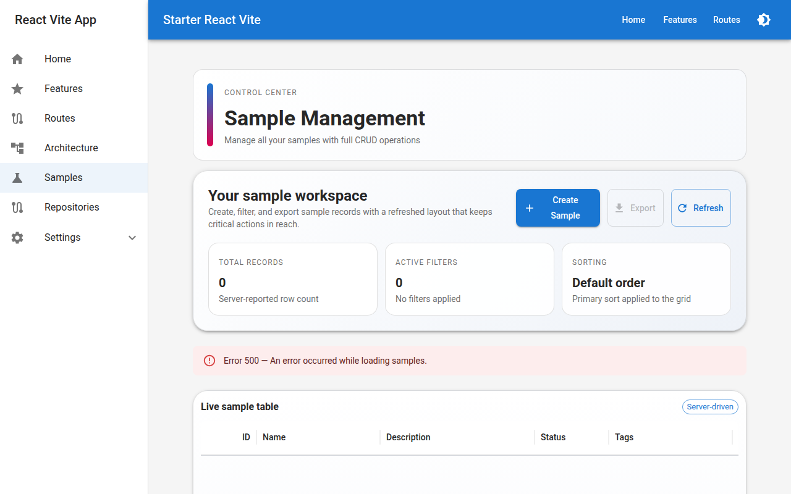
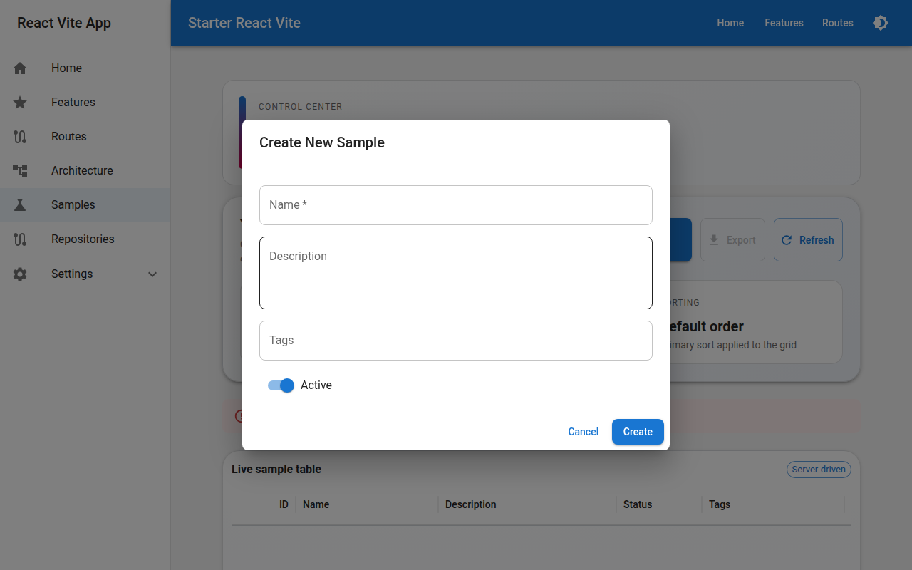

# Sample Management

The **Samples** page (`/samples`) is the primary domain use-case bundled with this starter. It demonstrates a complete, production-style CRUD workflow backed by a REST API.

---

## Overview



The page contains three main areas:

1. **Toolbar** — Create, Export, and Refresh actions plus a workspace description.
2. **Stats bar** — Live counters for total records, active filters, and current sort.
3. **DataGrid** — Server-driven table with pagination, sorting, filtering, and row actions.

---

## The Sample Entity

A _sample_ is a generic domain object with the following fields:

| Field | Type | Notes |
|---|---|---|
| `id` | number | Auto-assigned by the backend |
| `name` | string | **Required** |
| `description` | string | Optional free text |
| `active` | boolean | Defaults to `true` |
| `tags` | Tag[] | Many-to-many, optional |
| `createdAt` | string (ISO 8601) | Set by the backend |
| `createdBy` | string | Set by the backend |
| `updatedAt` | string (ISO 8601) | Set by the backend |
| `updatedBy` | string | Set by the backend |

---

## Creating a Sample



Click **Create Sample** in the toolbar to open the creation dialog. The form is powered by **React Hook Form** and validates fields before submission.

### Fields

| Field | Validation | Notes |
|---|---|---|
| Name | Required | Minimum 1 character |
| Description | Optional | Multiline textarea |
| Tags | Optional | Autocomplete from existing tags; supports free-solo entry |
| Active | Optional | Toggle switch, defaults to ON |

### Behaviour

- The form **resets** every time the dialog is opened.
- If the backend returns validation errors (`violations` object), they are displayed inline below the relevant field.
- A spinner replaces the **Create** button while the request is in flight.
- On success the dialog closes and the grid auto-refreshes.

---

## Viewing a Sample

Click the **👁 eye icon** in the Actions column to open the read-only details dialog. It shows all fields including the audit timestamps (`createdAt`, `updatedAt`, `createdBy`, `updatedBy`).

---

## Editing a Sample

Click the **✏️ pencil icon** in the Actions column. The update dialog is pre-filled with the current values. The `id` field is displayed but cannot be changed.

Submission behaviour is identical to the Create dialog — server-side violations surface as inline field errors.

---

## Deleting a Sample

Click the **🗑 trash icon** in the Actions column. A confirmation dialog appears before the request is sent to prevent accidental deletion. Any server error is displayed inline in the dialog.

---

## Searching & Filtering

The DataGrid exposes filtering through the MUI X column-menu filter panel. Filters are translated into the backend's `SampleSearchRequest` format:

```typescript
{
  page: number;        // Zero-based page index
  pageSize: number;    // Items per page
  sortField?: string;  // Column field name
  sortDirection?: "asc" | "desc";
  filters?: Array<{
    field: string;
    operator: string;  // "contains", "equals", "startsWith", etc.
    value: string;
  }>;
  logicOperator?: "and" | "or";
}
```

The stats bar updates in real time as filters are applied, showing how many filters are currently active.

---

## Pagination

The DataGrid uses **server-side pagination**. Supported page sizes are `5`, `10`, `25`, and `50` rows. The total row count is reported by the backend and drives the pagination controls.

---

## Tag Management

Tags are managed through the autocomplete field in the create/edit forms:

- Existing tags are loaded from the `/api/tags` endpoint.
- Free-solo entry lets users create new tags on the fly by typing a new name and pressing **Enter** or **comma**.
- Tags are displayed as MUI `<Chip>` components in the DataGrid's **Tags** column.

---

## API Hooks Used

| Hook | Operation |
|---|---|
| `useSearchSamplesMutation` | Fetch a page of samples with filters & sort |
| `useGetSampleQuery` | Fetch a single sample by ID |
| `useCreateSampleMutation` | Create a new sample |
| `useUpdateSampleMutation` | Update an existing sample |
| `useDeleteSampleMutation` | Delete a sample |
| `useGetAllTagsQuery` | Load tags for the autocomplete |

All hooks are generated by RTK Query from the OpenAPI spec via `pnpm codegen`.
