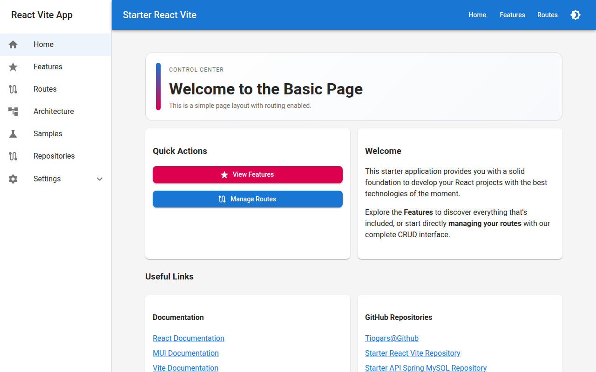

# Starter React Vite

**A production-ready React starter template** with everything you need to build modern, enterprise-grade web applications.

[](https://tiogars.github.io/starter-react-vite/)
[](https://github.com/tiogars/starter-react-vite)
[](https://github.com/tiogars/starter-react-vite/blob/main/LICENSE)

---



## What is this?

**Starter React Vite** is a batteries-included template for quickly bootstrapping React applications. It ships with a complete set of production patterns:

- 🎨 **Material UI v7** — polished, accessible components with light/dark theming
- 📋 **React Hook Form** — performant, schema-driven forms with server-error mapping
- 📊 **MUI X DataGrid** — server-side pagination, sorting, and filtering out of the box
- 🔄 **RTK Query** — auto-caching data fetching layer generated from an OpenAPI spec
- 🛣️ **React Router v7** — nested routing with code-split pages
- 🧪 **Vitest + Testing Library** — unit and integration tests pre-configured
- 🚀 **GitHub Actions CI/CD** — automated build, test, and GitHub Pages deployment

---

## Key Capabilities

| Capability | Detail |
|---|---|
| CRUD sample management | Full create / read / update / delete flow with optimistic UI feedback |
| Server-side DataGrid | Pagination, multi-column sort, field filtering — all driven by the backend |
| Validated forms | Required fields, server violation mapping, autocomplete tag selection |
| Data export | JSON, CSV, Excel, PDF, XML — scoped to all rows, current page, or selection |
| Data import | Bulk file import with per-row status report |
| Theme switching | Light, dark, and switchable variants persisted to `localStorage` |
| API configuration | Configurable backend URL, persisted to `localStorage` |
| SonarQube quality gate | Code quality and 80 % coverage gate enforced in CI |

---

## Tech Stack

```
React 19 · TypeScript 5 · Vite 7
Material-UI v7 · MUI X DataGrid v8
React Hook Form v7 · Redux Toolkit v2 · RTK Query
React Router v7 · Recharts v3 · Luxon v3
Vitest v4 · Testing Library
```

---

## Quick Links

<div class="grid cards" markdown>

- :material-rocket-launch: **[Installation](getting-started/installation.md)**  
  Get the project running in under five minutes.

- :material-play-circle: **[Quick Start](getting-started/quick-start.md)**  
  A tour of the main UI areas and workflows.

- :material-view-grid: **[MUI DataGrid](technical/mui-datagrid.md)**  
  Deep-dive into server-side grid configuration.

- :material-form-select: **[React Hook Form](technical/react-hook-forms.md)**  
  How forms are structured and validated.

</div>

---

## Live Demo

🚀 **[View the live application](https://tiogars.github.io/starter-react-vite/)**

The demo runs against a local in-memory state. To enable full CRUD functionality connect the app to the companion [Starter API Spring MySQL](https://github.com/tiogars/starter-api-spring-mysql) backend.
