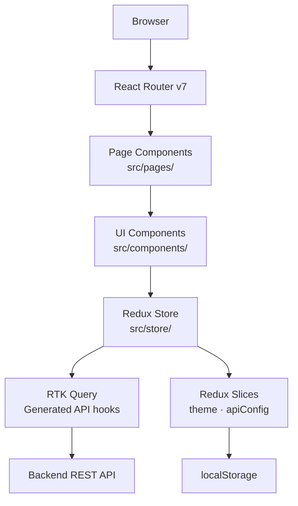

# Architecture

This page describes the high-level structure of the **Starter React Vite** codebase.

---

## Directory Layout

```
starter-react-vite/
├── .github/
│   └── workflows/          # CI/CD: build, deploy, release, docs
├── public/
│   └── 404.html            # SPA fallback for GitHub Pages
├── src/
│   ├── components/         # Reusable React components
│   ├── hooks/              # Custom React hooks
│   ├── pages/              # Page-level components (one per route)
│   ├── routes/             # React Router configuration
│   ├── store/              # Redux store, slices, RTK Query APIs
│   ├── theme/              # MUI theme factory
│   ├── utils/              # Pure utility functions
│   ├── App.tsx             # Root component (providers)
│   ├── main.tsx            # Entry point
│   └── setupTests.ts       # Vitest global setup
├── docs/                   # MkDocs documentation source
├── mkdocs.yml              # MkDocs configuration
├── vite.config.ts          # Vite + Vitest configuration
├── eslint.config.js        # ESLint flat-config
├── Dockerfile              # Production container image
└── docker-compose.yml      # Local container orchestration
```

---

## Layers



---

## State Management

State is split into two categories:

### Server State (RTK Query)

All API data (samples, tags, routes, repositories) is managed by RTK Query. Benefits:

- **Automatic caching** — duplicate requests within the cache window are de-duplicated.
- **Background re-fetching** — stale data is silently refreshed.
- **Optimistic updates** — mutations can optimistically update the cache before the server responds.
- **Tag invalidation** — mutations declare which query tags they invalidate, keeping the grid in sync.

The API hooks are auto-generated from the backend's OpenAPI specification:

```bash
pnpm codegen   # regenerates src/store/*Api.ts
```

### Client State (Redux Slices)

Two slices manage local persistent state:

| Slice | State | Persistence |
|---|---|---|
| `themeSlice` | `mode` (light/dark), `variant` (light-only/dark-only/switchable) | `localStorage` |
| `apiConfigSlice` | `apiUrl` | `localStorage` |

---

## Component Patterns

### Page Components (`src/pages/`)

Each page is a self-contained React component that:

1. Reads data via RTK Query hooks.
2. Manages local UI state (dialog open/closed, selected rows, pagination model).
3. Renders layout with `<BasicPage>` wrapper.
4. Delegates complex UI to sub-components in `src/components/`.

### Reusable Components (`src/components/`)

Components follow the **SampleComponent** pattern established in the codebase:

- `ComponentName/index.tsx` — implementation
- `ComponentName/ComponentName.types.ts` — props interface (exported separately)
- `ComponentName/ComponentName.test.tsx` — Vitest unit tests
- Named export + default export

### Custom Hooks (`src/hooks/`)

Complex stateful logic is extracted into custom hooks. For example, `useSampleGrid` encapsulates the DataGrid column definitions and action callbacks, keeping the page component focused on orchestration.

---

## API Configuration

The backend URL is read at runtime from Redux (`selectApiUrl`). The RTK Query `baseQuery` picks it up dynamically:

```typescript
// src/store/emptyApi.ts
const dynamicBaseQuery: BaseQueryFn = async (args, api, extraOptions) => {
  const state = api.getState() as RootState;
  const baseUrl = selectApiUrl(state);
  const rawBaseQuery = fetchBaseQuery({ baseUrl, timeout: API_TIMEOUT_MS });
  return rawBaseQuery(args, api, extraOptions);
};
```

This allows users to point the app at any backend instance without a rebuild.

---

## Routing

Routes are defined in `src/routes/index.tsx` using `createBrowserRouter`. The structure is:

```
/ (Layout)
├── /                    HomePage
├── /features            FeaturesPage
├── /routes              RoutePage
├── /architecture        ArchitecturePage
├── /samples             SamplePage
├── /repositories        RepositoryPage
└── /settings            SettingsPage (nested)
    ├── /settings/theme  ThemeSettingsPage
    ├── /settings/config ConfigSettingsPage
    └── /settings/api    ApiSetupPage
```

The `<Layout>` component renders the persistent sidebar and app bar, wrapping all child pages.

---

## Testing Strategy

| Test type | Tool | Location |
|---|---|---|
| Unit — components | Vitest + Testing Library | `ComponentName.test.tsx` alongside component |
| Unit — hooks | `renderHook` | `hookName.test.ts` |
| Unit — Redux slices | Vitest | `sliceName.test.ts` |
| Coverage enforcement | Istanbul (via Vitest) | Threshold: 80 % lines / functions / branches |
| Static analysis | SonarQube | CI quality gate in `build.yml` |
