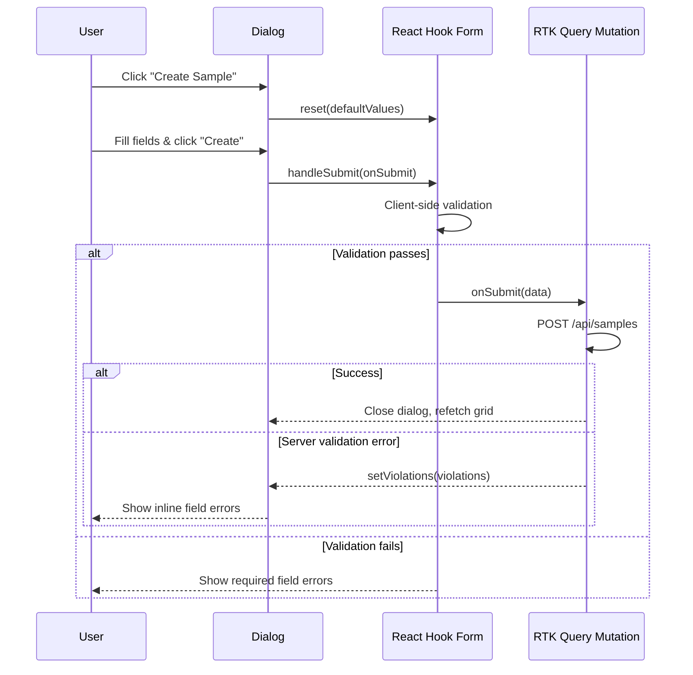

# React Hook Form — Technical Review

This project uses [React Hook Form v7](https://react-hook-form.com/) for all create and edit dialogs. This page explains the patterns used and the rationale for each decision.

---

## Why React Hook Form?

| Concern | React Hook Form approach | Benefit |
|---|---|---|
| Re-renders | Uncontrolled inputs; only re-renders on validation | Significantly faster than Formik / redux-form |
| Bundle size | ~9 KB gzipped | No runtime dependencies |
| MUI integration | `<Controller>` wraps any controlled MUI input | First-class support |
| Server errors | Manual `setError` call after mutation | Field-level server messages displayed inline |
| TypeScript | Generic `useForm<T>()` | Full type inference on field values |

---

## Implementation Pattern

All forms in this project follow the same structure. The `SampleCreateDialog` is the canonical example.

### 1. Define the form type

Form field types come directly from the generated RTK Query types:

```typescript
// Generated by RTK Query codegen
export interface SampleCreateForm {
  name: string;
  description?: string;
  active?: boolean;
  tagNames?: string[];
}
```

### 2. Initialize the form

```typescript
import { useForm, Controller } from 'react-hook-form';

const {
  control,
  handleSubmit,
  reset,
  formState: { errors },
} = useForm<SampleCreateForm>({
  defaultValues: {
    name: '',
    description: '',
    active: true,
    tagNames: [],
  },
});
```

Key points:
- `control` is passed to each `<Controller>` to connect the input to the form.
- `errors` contains field-level validation messages.
- `reset()` is called when the dialog opens to clear stale values.

### 3. Reset on open

The form is reset every time the dialog opens using a `useEffect`:

```typescript
useEffect(() => {
  if (open) {
    reset({ name: '', description: '', active: true, tagNames: [] });
  }
}, [open, reset]);
```

This ensures stale data from a previous submission never leaks into a new form session.

### 4. Wrap MUI inputs with `<Controller>`

MUI components are controlled components (they manage their own value/onChange). `<Controller>` bridges the gap between RHF's uncontrolled model and MUI's controlled model:

```tsx
<Controller
  name="name"
  control={control}
  rules={{ required: 'Name is required' }}
  render={({ field, fieldState }) => (
    <TextField
      {...field}
      label="Name"
      required
      error={!!fieldState.error}
      helperText={fieldState.error?.message ?? violations?.name}
    />
  )}
/>
```

The `violations` prop carries field-level errors returned by the backend (e.g. `{ name: 'already exists' }`). They are displayed in `helperText` alongside client-side validation messages.

### 5. Handle the Autocomplete field

The tag autocomplete is the most complex field because it involves:
- Loading async options from the API.
- Free-solo entry (typing a value not in the list).
- Managing an array of strings.

```tsx
<Controller
  name="tagNames"
  control={control}
  render={({ field }) => (
    <Autocomplete
      multiple
      freeSolo
      options={tagOptions}                  // string[] from useGetAllTagsQuery
      value={field.value ?? []}
      onChange={(_, newValue) => field.onChange(newValue)}
      renderTags={(value, getTagProps) =>
        value.map((option, index) => (
          <Chip label={option} {...getTagProps({ index })} key={option} />
        ))
      }
      renderInput={(params) => (
        <TextField {...params} label="Tags" />
      )}
    />
  )}
/>
```

### 6. Submit and surface server errors

```typescript
const handleFormSubmit = (data: SampleCreateForm) => {
  onSubmit(data); // calls the RTK Query mutation in the parent
};
```

The parent page handles the mutation result and passes `violations` back down as a prop. If the backend returns a `violations` object, each field's `<Controller>` renders it in `helperText`.

```typescript
// Parent page (SamplePage)
const [create] = useCreateSampleMutation();

const handleCreate = async (data: SampleCreateForm) => {
  const result = await create(data);
  if ('error' in result) {
    const { violations } = getErrorParts(result.error);
    setCreateViolations(violations ?? {});
  } else {
    setCreateDialogOpen(false);
    refetch();
  }
};
```

---

## Form Dialog Lifecycle



---

## Testing Forms

Forms are tested with `renderWithProviders` to supply the Redux store, and `userEvent` to simulate real user interactions:

```typescript
it('should show validation error when name is empty', async () => {
  render(<SampleCreateDialog open onSubmit={vi.fn()} onCancel={vi.fn()} />);

  await userEvent.click(screen.getByRole('button', { name: 'Create' }));

  expect(screen.getByText('Name is required')).toBeInTheDocument();
});
```

---

## File Reference

| File | Purpose |
|---|---|
| `src/components/SampleCreateDialog/` | Create form dialog |
| `src/components/SampleUpdateDialog/` | Edit form dialog |
| `src/store/sampleApi.ts` | `SampleCreateForm`, `SampleUpdateForm` types |
| `src/pages/SamplePage/index.tsx` | Mutation calls and server-error mapping |
